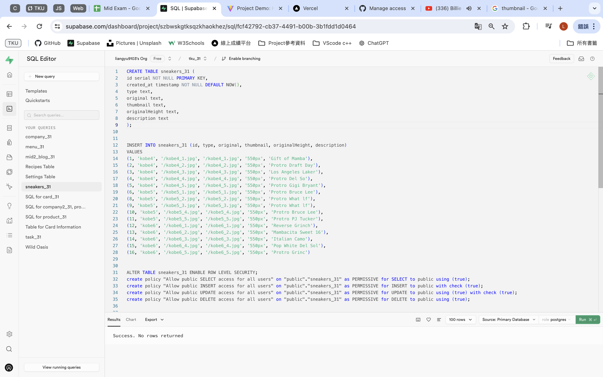
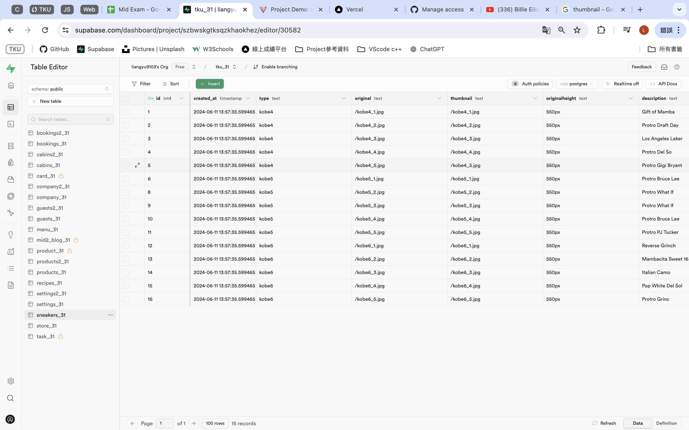
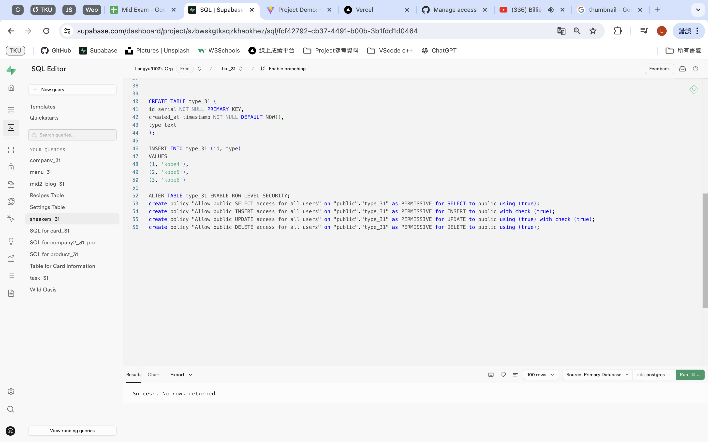
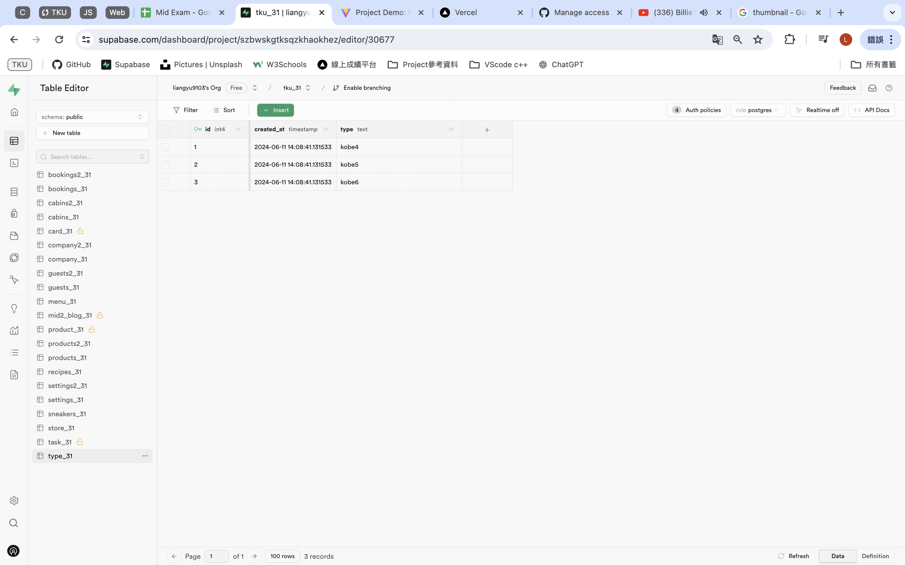
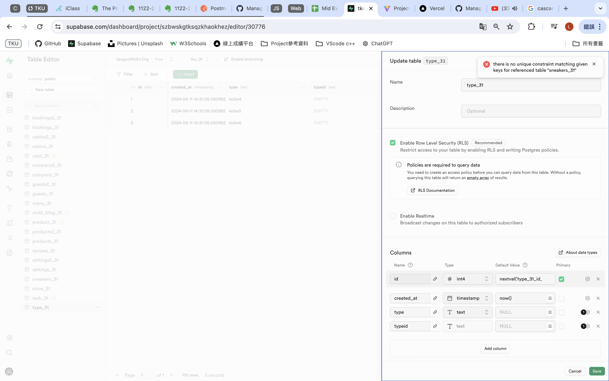
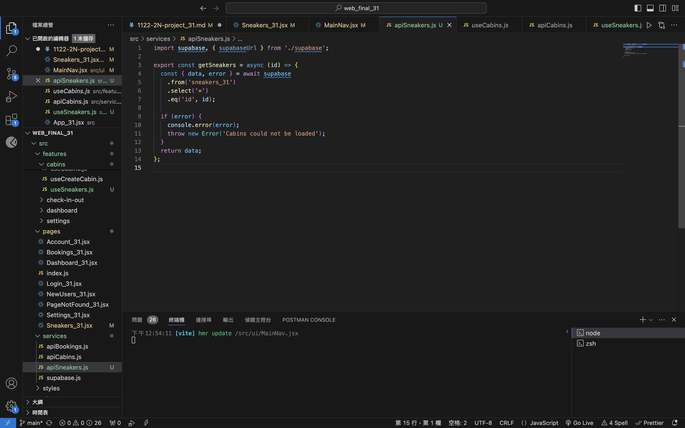
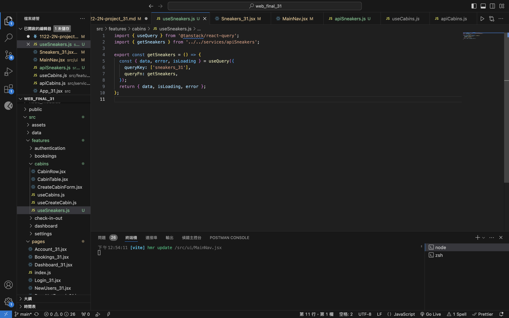

[Final Project -- Github URL](https://github.com/liangyu9103/web_final_31)

[Final Project -- Vercel URL](https://web-final-31.vercel.app/)

## 評分說明

1. 基本分：(30%~70%)
   依老師上課架構及內容，改換成其他應用，基本上可以執行者
2. 進階分 (30%)
   依前台及後台完成度評分，自己努力愈多，完成度愈高者，分數愈高。

## Project 說明

### 重點 1 -- 單人，還是兩人，如何分工

> 我是一個人做 Project

### 重點 2 -- Project 簡要介紹

#### => project requirements

> Project 的主題是球星 Kobe Bryant 的歷史，以及他的球鞋們，可以讓喜愛 Kobe Bryant 的球迷們瞭解他的生平，與他代表性的球鞋

#### => featured category, pages with routes

> 頁面部分包含“Home"、“Sneakers"

### 重點 3 -- Supabase 後台 schemas and data 支援

> 使用 SQL 指令來新增 Table "sneakers_31"以及資料(圖 1)
> 圖 1
> 

---

> 成功建立 Table "sneakers_31"資料(圖 2)
> 圖 2
> 

---

> 使用 SQL 指令來新增 Table "type_31"以及資料(圖 3)
> 圖 3
> 

---

> 成功建立 Table "type_31"資料(圖 2)，預計拿來當作 foreign key 的資料，不過遇到建立 foreign key 有遇到困難，可參考解決問題說明-問題 1
> 圖 4
> 

### 重點 4 -- React 前台， code 模組設計

> 前台的基礎架構是利用老師上課範例 Cabin 去做新增以及修改
> 頁面“Sneakers“是使用了 react 的套件去製作(可參考網路資源來源 1)

### 重點 5 -- 整體完成度

- 6/4 繳交進度：

  > 只完成的前端的設計，資料都是放在本地，尚未製作資料庫，連接 Supabase
  > 預計後續於 Supabase 建立兩個 Table 並設定 foreign key 來顯示資料

- 6/11 繳交進度：

---

## 資料及網路資源來源說明

### 網路資源來源 1

[React-image-gallery](https://www.npmjs.com/package/react-image-gallery)

### 網路資源來源 2

### 網路資源來源 3

---

## 後端 Supabase 資料庫設計

### SQL schema and data

#### => table 1

> 使用 SQL 指令來新增 Table "sneakers_31"以及資料(圖 1)
> 圖 1
> 

---

> 成功建立 Table "sneakers_31"資料(圖 2)
> 圖 2
> 

#### => table 2

> 使用 SQL 指令來新增 Table "type_31"以及資料(圖 3)
> 圖 3
> 

---

> 成功建立 Table "type_31"資料(圖 2)，預計拿來當作 foreign key 的資料，不過遇到建立 foreign key 有遇到困難，可參考解決問題說明-問題 1
> 圖 4
> 

#### => table 3

#### => 外部鍵及 RLS 設定

- 目前遇到困難，可參考解決問題說明問題 1

#### => 提供執行一次就可重新建立 schema 及 data 之 SQL 指令

```
DROP DATABASE type_31
TRUNCATE TABLE type_31
```

---

## 前端程式設計說明

### => 功能 1 ，畫面設計，完成度說明

> 頁面“Sneakers“上方做了 Tab，方便使用者根據鞋子的不同代去做選擇，功能目前已實作完成

### => 功能 2 及畫面設計，完成度說明

> 頁面“Sneakers“是使用了 react 的套件去製作，可以藉由切換圖片去瀏覽鞋子，功能目前已實作完成

### => 功能 3 及畫面設計，完成度說明

### => 功能 4 及畫面設計，完成度說明

### => 功能 5 及畫面設計，完成度說明

---

## 解決問題說明

### => 問題 1

> 無法成功將 Table "sneakers_31"與“type_31"建立 foreign key(圖 1)
> 

> （尚未解決）

### => 問題 2

> 新增了一些 code 嘗試連至 Supabase，目前無法成功(圖 2)
> 圖 2-apiSneakers.js
> 

> 圖 3-useSneakers.js
> 

> （尚未解決）

### => 問題 3

### => 問題 4

### => 問題 5

---

## 學習甘苦談

### => 1.

> 我覺得要把網路上的資料轉換到自己的 code 裡面目前對我來說還是會花不少時間，像是把 React-image-gallery 的內容轉換成自己的 code，並且要能成功運行，不管是 css 上的調整或是修改 jsx 都是一項挑戰！

### => 2.

### => 3.

### => 4.

### => 5.
